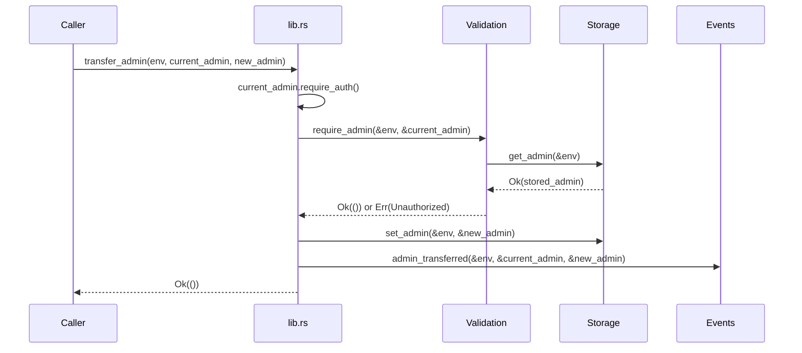

# Design Document: Admin Transfer

## Overview

The `transfer_admin` function gives the current TrustLink admin a safe, atomic way to hand off admin rights to a new address. The operation follows the same authorization pattern used by every other admin-gated function in the contract: the caller passes their address, Soroban requires their signature, and `Validation::require_admin` confirms they are the stored admin before any state is mutated. On success, `Storage::set_admin` atomically replaces the stored admin and an `adm_xfer` event is emitted for off-chain auditability.

## Architecture

The feature touches four existing modules and adds no new files:

```
src/lib.rs          ← new transfer_admin entry point
src/validation.rs   ← reuses Validation::require_admin (no changes)
src/storage.rs      ← reuses Storage::set_admin / Storage::get_admin (no changes)
src/events.rs       ← new Events::admin_transferred helper
src/test.rs         ← new unit tests
```

The call flow is:



## Components and Interfaces

### `TrustLinkContract::transfer_admin` (src/lib.rs)

```rust
pub fn transfer_admin(env: Env, current_admin: Address, new_admin: Address) -> Result<(), Error>
```

Steps:
1. `current_admin.require_auth()` — Soroban enforces the signature.
2. `Validation::require_admin(&env, &current_admin)?` — confirms `current_admin` is the stored admin; returns `Error::Unauthorized` or `Error::NotInitialized` on failure.
3. `Storage::set_admin(&env, &new_admin)` — atomically overwrites the admin in instance storage.
4. `Events::admin_transferred(&env, &current_admin, &new_admin)` — emits the audit event.
5. Return `Ok(())`.

### `Events::admin_transferred` (src/events.rs)

```rust
pub fn admin_transferred(env: &Env, old_admin: &Address, new_admin: &Address)
```

Publishes with:
- Topic: `(symbol_short!("adm_xfer"),)`
- Data: `(old_admin.clone(), new_admin.clone())`

This matches the existing event style used by `admin_initialized` and `issuer_registered`.

## Data Models

No new storage keys or types are required. The existing `StorageKey::Admin` in instance storage is reused. `Storage::set_admin` already handles TTL refresh on write.

## Correctness Properties

*A property is a characteristic or behavior that should hold true across all valid executions of a system — essentially, a formal statement about what the system should do. Properties serve as the bridge between human-readable specifications and machine-verifiable correctness guarantees.*

Property 1: Non-admin cannot transfer
*For any* initialized contract and any address that is not the current admin, calling `transfer_admin` with that address as `current_admin` SHALL return `Error::Unauthorized`.
**Validates: Requirements 2.1, 2.3**

Property 2: Admin address updated after transfer
*For any* valid current admin address and any new admin address, after a successful `transfer_admin` call, `get_admin()` SHALL return `new_admin`.
**Validates: Requirements 1.3**

Property 3: Privilege handoff is complete and immediate
*For any* successful `transfer_admin` call, the old admin address SHALL be rejected with `Error::Unauthorized` on any subsequent admin-gated call, and the new admin address SHALL succeed on an immediate `register_issuer` call.
**Validates: Requirements 3.1, 3.2**

Property 4: Exactly one event with correct data is emitted
*For any* successful `transfer_admin` call, exactly one event with topic `adm_xfer` SHALL be present in the event log, and its data SHALL contain the old admin address and the new admin address.
**Validates: Requirements 1.4, 4.1, 4.2**

Edge Case — Uninitialized contract:
Calling `transfer_admin` on a contract that has not been initialized SHALL return `Error::NotInitialized`.
**Validates: Requirements 2.2**

## Error Handling

| Condition | Error returned |
|---|---|
| Contract not initialized | `Error::NotInitialized` |
| `current_admin` ≠ stored admin | `Error::Unauthorized` |
| Soroban auth missing for `current_admin` | Soroban auth failure (panics in production, caught in tests via `should_panic`) |

No new error variants are needed; the existing `Error` enum covers all cases.

## Testing Strategy

**Dual testing approach**: unit tests for specific examples and edge cases; property-based tests for universal correctness.

**Unit tests** (in `src/test.rs`):
- `test_transfer_admin_success` — happy path: transfer succeeds, `get_admin` returns new admin.
- `test_transfer_admin_old_admin_loses_privileges` — after transfer, old admin cannot call `register_issuer`.
- `test_transfer_admin_new_admin_can_register_issuer` — after transfer, new admin can call `register_issuer`.
- `test_transfer_admin_emits_event` — verify `adm_xfer` event is emitted with correct addresses.
- `test_transfer_admin_unauthorized` — non-admin caller returns `Error::Unauthorized`.
- `test_transfer_admin_not_initialized` — uninitialized contract returns `Error::NotInitialized`.

**Property-based testing**: The Soroban test environment uses `env.mock_all_auths()` and deterministic address generation, so property-style coverage is achieved by parameterizing tests with `Address::generate(&env)` in loops or by writing table-driven tests. A dedicated property-based testing library (e.g., `proptest`) is not standard in Soroban contract test suites due to `no_std` constraints; instead, each property above is validated by a focused unit test that exercises the universal rule with generated addresses.

Each test MUST reference the property it validates via a comment:
```rust
// Property 2: Admin address updated after transfer — Validates: Requirements 1.3
```

Minimum coverage: all 4 properties and the edge case must have at least one test each.
