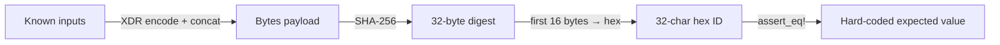

# Design Document: Attestation ID Stability

## Overview

The attestation ID stability feature adds hard-coded regression tests and inline documentation
to guarantee that `Attestation::generate_id` and `Attestation::generate_bridge_id` in
`src/types.rs` produce byte-for-byte identical output for the same inputs across all Soroban
environment versions. It also adds a CHANGELOG entry so consumers know when this guarantee
was introduced.

The feature is purely additive: no production logic changes, only new tests and documentation.

## Architecture

The existing ID generation pipeline is:

```
inputs (Address, String, u64)
  └─► XDR-encode each field via ToXdr
  └─► concatenate raw bytes into a Bytes buffer
  └─► SHA-256 hash the buffer (env.crypto().sha256)
  └─► take first 16 bytes of the 32-byte digest
  └─► hex-encode to a 32-character lowercase ASCII string
```

This pipeline is already implemented in `Attestation::hash_payload`, `Attestation::generate_id`,
and `Attestation::generate_bridge_id` in `src/types.rs`. The design adds:

1. Inline doc-comments on those three functions describing the algorithm and field order.
2. Two regression tests in `src/test.rs` (one per ID variant) that hard-code a known input
   tuple and its expected hex digest.
3. A CHANGELOG entry under `[Unreleased] → Added`.



## Components and Interfaces

### `Attestation::hash_payload` (existing, to be documented)

```rust
pub fn hash_payload(env: &Env, payload: &Bytes) -> String
```

Hashes an arbitrary byte payload and returns a 32-character lowercase hex string.
Algorithm: SHA-256 → first 16 bytes → lowercase hex.

### `Attestation::generate_id` (existing, to be documented)

```rust
pub fn generate_id(
    env: &Env,
    issuer: &Address,
    subject: &Address,
    claim_type: &String,
    timestamp: u64,
) -> String
```

XDR field order: `issuer | subject | claim_type | timestamp`

### `Attestation::generate_bridge_id` (existing, to be documented)

```rust
pub fn generate_bridge_id(
    env: &Env,
    bridge: &Address,
    subject: &Address,
    claim_type: &String,
    source_chain: &String,
    source_tx: &String,
    timestamp: u64,
) -> String
```

XDR field order: `bridge | subject | claim_type | source_chain | source_tx | timestamp`

### Regression tests (new, in `src/test.rs`)

Two `#[test]` functions:

- `test_generate_id_stability` — standard attestation ID regression
- `test_generate_bridge_id_stability` — bridge attestation ID regression

Each test constructs a `soroban_sdk::Env`, creates fixed `Address` values from known byte
slices, calls the respective generator, and asserts the result equals a hard-coded hex string.

## Data Models

No new data models are introduced. The existing types involved are:

| Type | Role |
|------|------|
| `soroban_sdk::Address` | Issuer / subject / bridge address, XDR-encoded as input |
| `soroban_sdk::String` | Claim type / source chain / source tx, XDR-encoded as input |
| `u64` | Timestamp, XDR-encoded as input |
| `soroban_sdk::Bytes` | Intermediate concatenated payload |
| `soroban_sdk::String` (32 chars) | Output attestation ID |

The regression tests use `Address::from_str` (or equivalent deterministic construction) so
the same address bytes are produced on every test run regardless of environment randomness.


## Correctness Properties

*A property is a characteristic or behavior that should hold true across all valid executions
of a system — essentially, a formal statement about what the system should do. Properties
serve as the bridge between human-readable specifications and machine-verifiable correctness
guarantees.*

### Property 1: Output format invariant

*For any* valid combination of inputs to either `generate_id` or `generate_bridge_id`, the
returned string must be exactly 32 characters long and consist only of lowercase hexadecimal
digits (`[0-9a-f]`).

**Validates: Requirements 1.1, 2.1**

### Property 2: Determinism

*For any* fixed input tuple, calling `generate_id` (or `generate_bridge_id`) twice with
identical arguments must return the same string both times.

**Validates: Requirements 1.2, 2.2**

### Example 3: Standard attestation ID regression

For the specific hard-coded tuple `(issuer, subject, claim_type, timestamp)`, the computed
`generate_id` result must equal the pre-computed expected hex string captured at the time the
stability guarantee was established.

**Validates: Requirements 1.3, 1.4**

### Example 4: Bridge attestation ID regression

For the specific hard-coded tuple `(bridge, subject, claim_type, source_chain, source_tx,
timestamp)`, the computed `generate_bridge_id` result must equal the pre-computed expected
hex string captured at the time the stability guarantee was established.

**Validates: Requirements 2.3, 2.4**

## Error Handling

This feature introduces no new error paths. The ID generators are pure functions that always
succeed for any valid `Env` and non-null inputs. The only failure mode is a test assertion
failure, which is the intended canary behavior.

If a regression test fails, the Rust test runner will print:

```
thread 'test_generate_id_stability' panicked at 'assertion `left == right` failed
  left: "actual_computed_hex..."
 right: "expected_hardcoded_hex..."'
```

This message is self-identifying: the developer sees both the new (broken) value and the
expected (stable) value, making the regression immediately actionable.

## Testing Strategy

### Dual approach

Both unit/example tests and property-based tests are used:

- **Example tests** (unit): hard-coded input/output pairs that act as regression canaries.
  These catch any change to the algorithm, field order, or encoding.
- **Property tests**: generative tests that verify universal invariants (output format,
  determinism) across a wide range of random inputs.

### Property-based testing library

Use [`proptest`](https://github.com/proptest-rs/proptest) (crate `proptest = "1"`), the
standard Rust property-based testing library. Each property test must run a minimum of
**100 iterations** (proptest default is 256, which exceeds this).

Because `soroban_sdk::Address` and `soroban_sdk::String` require a live `Env`, property
tests will construct a single `Env::default()` and generate inputs as raw byte vectors that
are then converted into SDK types.

### Test inventory

| Test name | Kind | Design property |
|-----------|------|-----------------|
| `test_generate_id_output_format` | property | Property 1 |
| `test_generate_bridge_id_output_format` | property | Property 1 |
| `test_generate_id_determinism` | property | Property 2 |
| `test_generate_bridge_id_determinism` | property | Property 2 |
| `test_generate_id_stability` | example | Example 3 |
| `test_generate_bridge_id_stability` | example | Example 4 |

### Property test tag format

Each property test must include a comment in the following format:

```
// Feature: attestation-id-stability, Property 1: output is 32-char lowercase hex
```

### Unit test balance

- The two regression (example) tests are the primary correctness mechanism for the stability
  guarantee.
- Property tests cover format and determinism universally, reducing the need for additional
  hand-written examples.
- No additional unit tests are needed beyond what is listed above.
