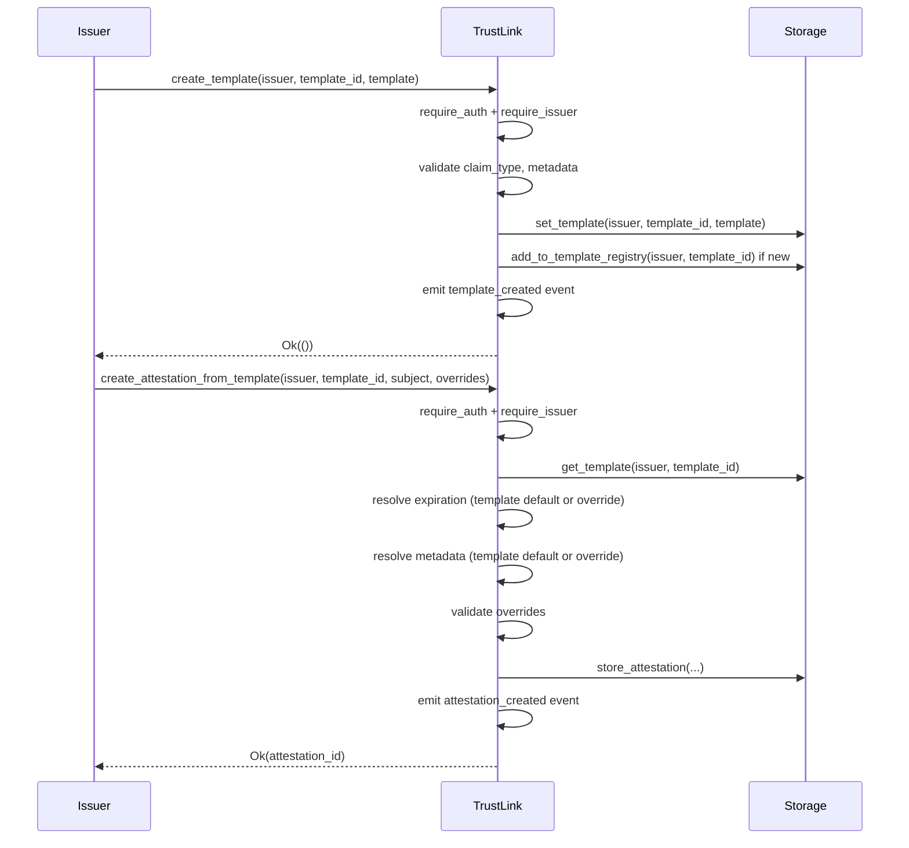

# Design Document: Attestation Templates

## Overview

Attestation Templates introduce a reusable blueprint layer on top of TrustLink's existing attestation creation flow. An issuer defines a named template once — capturing a `claim_type`, an optional default expiration window, and optional default metadata — and then instantiates attestations from it with a single call, optionally overriding individual fields per-call.

The feature is additive: it does not modify any existing entry points, storage keys, or event shapes. All new functionality lives in new storage keys, new contract methods, a new type, and a new event.

### Design Goals

- Zero impact on existing attestation flows.
- Templates are scoped per-issuer; no cross-issuer visibility or collision.
- Template instantiation reuses the existing `store_attestation` helper and `attestation_created` event, keeping indexers compatible.
- Validation mirrors the existing pattern: inline guards in `lib.rs` + `Validation` helpers, returning typed `Error` variants.

---

## Architecture

The feature slots into the existing layered architecture without restructuring it:

```
lib.rs  (entry points)
  │
  ├── validation.rs  (auth guards — unchanged)
  ├── storage.rs     (add Template* keys + helpers)
  ├── events.rs      (add template_created event)
  └── types.rs       (add AttestationTemplate struct + InvalidClaimType error)
```



---

## Components and Interfaces

### New Contract Entry Points (`src/lib.rs`)

```rust
/// Create or overwrite a named template for the calling issuer.
pub fn create_template(
    env: Env,
    issuer: Address,
    template_id: String,
    template: AttestationTemplate,
) -> Result<(), Error>

/// Instantiate an attestation from a template, with optional field overrides.
pub fn create_attestation_from_template(
    env: Env,
    issuer: Address,
    template_id: String,
    subject: Address,
    expiration_override: Option<u64>,
    metadata_override: Option<String>,
) -> Result<String, Error>

/// Return the ordered list of template IDs registered for an issuer.
pub fn list_templates(env: Env, issuer: Address) -> Vec<String>

/// Return a single template by issuer + template_id.
pub fn get_template(
    env: Env,
    issuer: Address,
    template_id: String,
) -> Result<AttestationTemplate, Error>
```

### Expiration Resolution Logic

`create_attestation_from_template` resolves the final expiration as follows:

```
if expiration_override is Some(ts):
    validate ts > current_ledger_timestamp  → Error::InvalidExpiration
    use ts
else if template.default_expiration_days is Some(n):
    use current_ledger_timestamp + (n * 86_400)
else:
    None  (no expiration)
```

---

## Data Models

### `AttestationTemplate` (new type in `src/types.rs`)

```rust
#[contracttype]
#[derive(Clone, Debug, Eq, PartialEq)]
pub struct AttestationTemplate {
    /// Non-empty claim type identifier (e.g. "KYC", "AML").
    pub claim_type: String,
    /// Optional default expiration window in days from attestation creation time.
    pub default_expiration_days: Option<u32>,
    /// Optional default metadata string (max 256 bytes).
    pub metadata_template: Option<String>,
}
```

### New `Error` Variant

```rust
/// claim_type field is empty.
InvalidClaimType = 21,
```

### New Storage Keys (`src/storage.rs`)

Two new variants are added to `StorageKey`:

```rust
/// Full AttestationTemplate record keyed by (issuer, template_id).
Template(Address, String),
/// Ordered Vec<String> of template IDs for an issuer (insertion order).
TemplateRegistry(Address),
```

Both use the **persistent** storage tier, consistent with all other per-issuer data. TTL is refreshed on every write using the existing `get_ttl_lifetime` helper.

### New Storage Helper Methods (`Storage` impl)

```rust
pub fn set_template(env: &Env, issuer: &Address, template_id: &String, template: &AttestationTemplate)
pub fn get_template(env: &Env, issuer: &Address, template_id: &String) -> Option<AttestationTemplate>
pub fn has_template(env: &Env, issuer: &Address, template_id: &String) -> bool
pub fn get_template_registry(env: &Env, issuer: &Address) -> Vec<String>
pub fn add_to_template_registry(env: &Env, issuer: &Address, template_id: &String)
```

### New Event (`src/events.rs`)

```rust
/// Emitted when create_template succeeds (create or overwrite).
pub fn template_created(env: &Env, issuer: &Address, template_id: &String)
```

Event shape (consistent with existing patterns):

```
topics: (symbol_short!("tmpl_crt"), issuer)
data:   template_id
```

---

## Correctness Properties

*A property is a characteristic or behavior that should hold true across all valid executions of a system — essentially, a formal statement about what the system should do. Properties serve as the bridge between human-readable specifications and machine-verifiable correctness guarantees.*


### Property 1: Template round-trip

*For any* registered issuer and valid `AttestationTemplate`, calling `create_template` followed by `get_template` with the same `(issuer, template_id)` pair should return a template equal to the one that was stored.

**Validates: Requirements 2.1, 5.1**

---

### Property 2: Metadata length validation

*For any* string used as `metadata_template` or `metadata_override`, the contract should accept it when its byte length is ≤ 256 and reject it with `Error::MetadataTooLong` when its byte length is > 256.

**Validates: Requirements 1.2, 2.4, 3.9**

---

### Property 3: Empty claim_type rejected

*For any* call to `create_template` where `claim_type` is an empty string, the contract should return `Error::InvalidClaimType` and leave storage unchanged.

**Validates: Requirements 1.3, 2.5**

---

### Property 4: Template overwrite

*For any* registered issuer and `template_id`, calling `create_template` twice with different template values should result in `get_template` returning the values from the second call.

**Validates: Requirements 2.2**

---

### Property 5: Non-issuer gets Unauthorized

*For any* address that is not a registered issuer, calling `create_template` or `create_attestation_from_template` should return `Error::Unauthorized`.

**Validates: Requirements 2.3, 3.7**

---

### Property 6: Template registry insertion order

*For any* registered issuer and sequence of `create_template` calls with distinct `template_id` values, `list_templates` should return all those IDs in the order they were first created, with no duplicates even if a template is overwritten.

**Validates: Requirements 2.6, 4.1, 4.2, 4.3**

---

### Property 7: Attestation fields match template defaults

*For any* registered issuer, valid template, and subject address, calling `create_attestation_from_template` without overrides should produce an attestation whose `claim_type` equals the template's `claim_type`, whose `metadata` equals the template's `metadata_template`, and whose `expiration` equals `current_timestamp + (default_expiration_days * 86400)` when `default_expiration_days` is `Some(n)`, or `None` when it is `None`.

**Validates: Requirements 3.1, 3.2, 3.3**

---

### Property 8: Overrides take precedence over template defaults

*For any* registered issuer, valid template, subject, and valid override values, calling `create_attestation_from_template` with `expiration_override = Some(ts)` or `metadata_override = Some(value)` should produce an attestation that uses the override value rather than the template default for the overridden field, while non-overridden fields still use the template defaults.

**Validates: Requirements 3.4, 3.5**

---

### Property 9: Missing template returns NotFound

*For any* issuer and `template_id` that has not been created, calling `get_template` or `create_attestation_from_template` should return `Error::NotFound`.

**Validates: Requirements 3.6, 5.2**

---

### Property 10: Invalid expiration override rejected

*For any* expiration override timestamp that is ≤ the current ledger timestamp, `create_attestation_from_template` should return `Error::InvalidExpiration` and no attestation should be stored.

**Validates: Requirements 3.8**

---

### Property 11: Attestation from template is indexed like a regular attestation

*For any* successful `create_attestation_from_template` call, the resulting attestation ID should be retrievable via `get_attestation`, and should appear in both the subject's and the issuer's attestation index (as returned by `get_subject_attestations` and `get_issuer_attestations`).

**Validates: Requirements 3.10**

---

### Property 12: Template storage isolation across issuers

*For any* two distinct registered issuers A and B who each create a template with the same `template_id` but different values, `get_template` for issuer A should return A's template and `get_template` for issuer B should return B's template, with no cross-contamination.

**Validates: Requirements 6.1, 6.2**

---

### Property 13: template_created event emitted on success

*For any* successful `create_template` call, the contract's event log should contain a `template_created` event whose data includes the calling issuer's address and the `template_id`.

**Validates: Requirements 7.1**

---

### Property 14: attestation_created event emitted on template instantiation

*For any* successful `create_attestation_from_template` call, the contract's event log should contain an `attestation_created` event (identical in shape to the one emitted by `create_attestation`) for the resulting attestation.

**Validates: Requirements 7.2**

---

## Error Handling

All new entry points follow the existing `Result<T, Error>` convention and return typed errors from the existing `Error` enum, plus one new variant:

| Error | Trigger |
|---|---|
| `Error::Unauthorized` | Caller is not a registered issuer |
| `Error::NotFound` | `template_id` does not exist for the issuer |
| `Error::MetadataTooLong` | `metadata_template` or `metadata_override` exceeds 256 bytes |
| `Error::InvalidClaimType` | `claim_type` is an empty string (new validation, new error variant) |
| `Error::InvalidExpiration` | `expiration_override` timestamp ≤ current ledger timestamp |

The new `InvalidClaimType = 21` variant is added to the `Error` enum in `src/types.rs`. No existing error codes are changed.

Validation order within `create_template`:
1. `issuer.require_auth()`
2. `Validation::require_issuer`
3. Validate `claim_type` non-empty → `InvalidClaimType`
4. Validate `metadata_template` length → `MetadataTooLong`
5. Persist template + update registry + emit event

Validation order within `create_attestation_from_template`:
1. `issuer.require_auth()`
2. `Validation::require_issuer`
3. Load template → `NotFound`
4. Validate `metadata_override` length → `MetadataTooLong`
5. Validate `expiration_override` > current timestamp → `InvalidExpiration`
6. Resolve final expiration and metadata
7. Call `store_attestation` + emit `attestation_created`

---

## Testing Strategy

### Dual Testing Approach

Both unit tests and property-based tests are required. They are complementary:

- **Unit tests** (`src/test.rs`) cover specific examples, integration between components, and error conditions with concrete inputs.
- **Property-based tests** (`tests/integration_test.rs` or a dedicated `tests/template_property_tests.rs`) verify universal properties across randomly generated inputs.

### Unit Test Coverage

Concrete examples to cover:

- `create_template` happy path: create, then `get_template` returns same struct.
- `create_template` overwrite: create twice with same ID, second values win.
- `create_template` with empty `claim_type` → `InvalidClaimType`.
- `create_template` with 257-byte `metadata_template` → `MetadataTooLong`.
- `create_template` from non-issuer → `Unauthorized`.
- `list_templates` returns IDs in insertion order; overwrite does not duplicate.
- `list_templates` for issuer with no templates returns empty vec.
- `get_template` for unknown ID → `NotFound`.
- `create_attestation_from_template` happy path: verify `claim_type`, `metadata`, and computed expiration.
- `create_attestation_from_template` with `expiration_override` and `metadata_override`.
- `create_attestation_from_template` with unknown `template_id` → `NotFound`.
- `create_attestation_from_template` with stale `expiration_override` → `InvalidExpiration`.
- `create_attestation_from_template` with 257-byte `metadata_override` → `MetadataTooLong`.
- Two issuers with same `template_id` store and retrieve independently.
- `template_created` event is present after `create_template`.
- `attestation_created` event is present after `create_attestation_from_template`.

### Property-Based Testing

**Library**: [`proptest`](https://github.com/proptest-rs/proptest) (the standard PBT library for Rust).

**Configuration**: Each property test must run a minimum of **100 iterations**.

Each property test must include a comment in the format:
```
// Feature: attestation-templates, Property N: <property_text>
```

| Property | Test description |
|---|---|
| P1 | Generate random valid templates; create then get returns equal value |
| P2 | Generate strings of length 0–512; verify accept/reject boundary at 256 |
| P3 | Generate arbitrary strings; empty string always rejected with InvalidClaimType |
| P4 | Generate two different templates for same ID; second always wins |
| P5 | Generate random non-issuer addresses; always get Unauthorized |
| P6 | Generate sequences of distinct template IDs; list order matches creation order, no duplicates on overwrite |
| P7 | Generate templates with various expiration/metadata combos; attestation fields match |
| P8 | Generate valid overrides; override fields take precedence, non-overridden fields use template |
| P9 | Generate random IDs not in storage; always get NotFound |
| P10 | Generate timestamps ≤ current; always get InvalidExpiration |
| P11 | After successful instantiation, attestation appears in subject + issuer indexes |
| P12 | Two issuers, same template_id, different values; each retrieves own template |
| P13 | After create_template, event log contains template_created with correct issuer + id |
| P14 | After create_attestation_from_template, event log contains attestation_created |

> Note: Soroban's `Env` in tests is a mock environment. Property tests will use `soroban_sdk::testutils` to construct the mock env and advance the ledger timestamp as needed.
