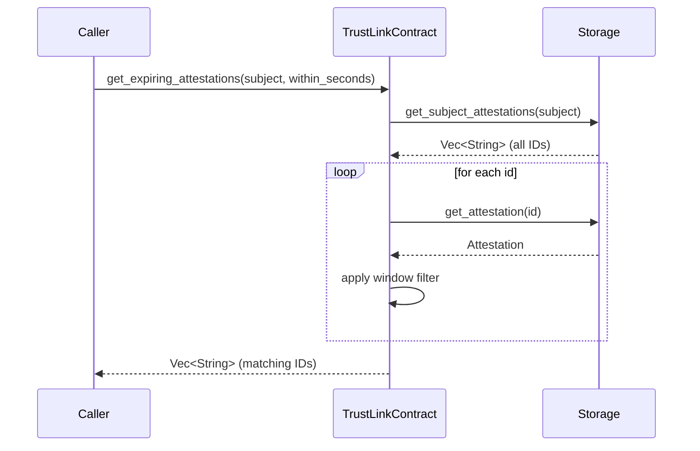

# Design Document: Expiration Warning Query

## Overview

This feature adds two read-only query functions to the TrustLink Soroban smart contract:

- `get_expiring_attestations(env, subject, within_seconds) -> Vec<String>`
- `get_issuer_expiring_attestations(env, issuer, within_seconds) -> Vec<String>`

Both functions scan the caller's attestation index, apply a time-window filter, and return the IDs of attestations whose expiration falls within `(current_time, current_time + within_seconds]`. Revoked attestations and those without an expiration are excluded. Neither function mutates contract state.

The implementation is purely additive: no new storage keys, no new types, no new events, and no changes to existing functions.

---

## Architecture

The feature follows the same layered pattern used throughout TrustLink:

```
TrustLinkContract (src/lib.rs)
    └── calls Storage helpers (src/storage.rs)
            └── reads persistent storage
```

Both new functions live in `TrustLinkContract` as `#[contractimpl]` methods. They delegate index retrieval to the existing `Storage::get_subject_attestations` / `Storage::get_issuer_attestations` helpers, then load each attestation via `Storage::get_attestation` and apply the window predicate inline.



The issuer-scoped variant is identical except it calls `get_issuer_attestations`.

---

## Components and Interfaces

### New contract functions

```rust
/// Returns IDs of attestations for `subject` whose expiration satisfies
/// `current_time < expiration <= current_time + within_seconds`.
/// Revoked attestations and those with no expiration are excluded.
pub fn get_expiring_attestations(
    env: Env,
    subject: Address,
    within_seconds: u64,
) -> Vec<String>

/// Returns IDs of attestations issued by `issuer` whose expiration satisfies
/// `current_time < expiration <= current_time + within_seconds`.
/// Revoked attestations and those with no expiration are excluded.
pub fn get_issuer_expiring_attestations(
    env: Env,
    issuer: Address,
    within_seconds: u64,
) -> Vec<String>
```

### Filter predicate

Both functions share the same inline predicate. For a given `attestation` and `current_time`:

```
include iff:
    attestation.revoked == false
    AND attestation.expiration == Some(exp)
    AND current_time < exp
    AND exp <= current_time + within_seconds
```

This maps directly to the window `(current_time, current_time + within_seconds]`.

### Reused storage helpers (unchanged)

| Helper | Purpose |
|---|---|
| `Storage::get_subject_attestations(env, subject)` | Returns `Vec<String>` of all attestation IDs for a subject |
| `Storage::get_issuer_attestations(env, issuer)` | Returns `Vec<String>` of all attestation IDs for an issuer |
| `Storage::get_attestation(env, id)` | Returns `Result<Attestation, Error>` for a given ID |

No new storage helpers are needed.

---

## Data Models

No new types are introduced. The relevant existing fields on `Attestation` are:

| Field | Type | Role in filter |
|---|---|---|
| `expiration` | `Option<u64>` | `None` → excluded; `Some(exp)` → checked against window |
| `revoked` | `bool` | `true` → excluded |

`current_time` is obtained from `env.ledger().timestamp()`, consistent with all other time-sensitive functions in the contract.

---

## Correctness Properties

*A property is a characteristic or behavior that should hold true across all valid executions of a system — essentially, a formal statement about what the system should do. Properties serve as the bridge between human-readable specifications and machine-verifiable correctness guarantees.*

### Property 1: Subject-scoped filter correctness

*For any* subject address and any `within_seconds` value, every attestation ID returned by `get_expiring_attestations(subject, within_seconds)` must, when fetched via `get_attestation`, have `revoked = false` and an `expiration` value `exp` satisfying `current_time < exp <= current_time + within_seconds`. Conversely, no attestation in the subject's index that satisfies the predicate should be absent from the result.

**Validates: Requirements 1.1, 1.2, 1.3, 1.4, 4.3**

### Property 2: Issuer-scoped filter correctness

*For any* issuer address and any `within_seconds` value, every attestation ID returned by `get_issuer_expiring_attestations(issuer, within_seconds)` must, when fetched via `get_attestation`, have `revoked = false` and an `expiration` value `exp` satisfying `current_time < exp <= current_time + within_seconds`. Conversely, no attestation in the issuer's index that satisfies the predicate should be absent from the result.

**Validates: Requirements 2.1, 2.2, 2.3, 2.4, 4.4**

### Property 3: Zero window always returns empty

*For any* subject or issuer address, calling either query function with `within_seconds = 0` must return an empty `Vec<String>`, because no attestation can satisfy `current_time < exp <= current_time`.

**Validates: Requirements 3.1**

### Property 4: Query idempotence

*For any* subject or issuer address and any `within_seconds` value, calling the same query function twice in succession without any intervening state mutation must return identical results both times.

**Validates: Requirements 4.1, 4.2**

---

## Error Handling

Both functions are infallible from the caller's perspective — they return `Vec<String>` (not `Result`). This matches the pattern of other read-only list functions in the contract (`get_subject_attestations`, `get_valid_claims`, etc.).

Internal handling:

- If `Storage::get_subject_attestations` / `Storage::get_issuer_attestations` finds no index entry, it returns an empty `Vec` (existing behavior). The function returns an empty result.
- If `Storage::get_attestation` returns `Err(Error::NotFound)` for an ID in the index (stale index entry), the entry is silently skipped. This is consistent with how `has_valid_claim` handles the same situation.
- Integer overflow on `current_time + within_seconds`: on Stellar, `env.ledger().timestamp()` is a `u64` and realistic values are well below `u64::MAX`. A saturating add (`current_time.saturating_add(within_seconds)`) is used to avoid any theoretical overflow without panicking.

---

## Testing Strategy

### Unit tests (`src/test.rs`)

Unit tests cover specific examples and boundary conditions:

- Subject with no attestations → empty result
- Subject with attestations all outside the window → empty result
- Subject with a mix of in-window and out-of-window attestations → only in-window IDs returned
- Attestation with `expiration = None` → excluded
- Attestation with `revoked = true` → excluded
- Boundary: `expiration = current_time + within_seconds` → included (inclusive upper bound)
- Boundary: `expiration = current_time + within_seconds + 1` → excluded
- Boundary: `expiration = current_time` → excluded (already expired)
- `within_seconds = 0` → empty result
- Issuer-scoped variants of the above

### Property-based tests (`tests/integration_test.rs` or a dedicated `tests/property_test.rs`)

Property-based tests use [`proptest`](https://github.com/proptest-rs/proptest) (the standard PBT library for Rust). Each test runs a minimum of 100 iterations.

Each test is tagged with a comment in the format:
`// Feature: expiration-warning-query, Property N: <property text>`

**Property test 1** — Subject-scoped filter correctness
```
// Feature: expiration-warning-query, Property 1: subject-scoped filter correctness
```
Generate: a random subject, a random `within_seconds`, and a random set of attestations with varied `expiration` and `revoked` values. Store them, call `get_expiring_attestations`, then for each returned ID call `get_attestation` and assert `revoked = false` and `exp` in `(current_time, current_time + within_seconds]`. Also assert no qualifying attestation is missing from the result.

**Property test 2** — Issuer-scoped filter correctness
```
// Feature: expiration-warning-query, Property 2: issuer-scoped filter correctness
```
Same structure as Property test 1 but using `get_issuer_expiring_attestations` and the issuer index.

**Property test 3** — Zero window always returns empty
```
// Feature: expiration-warning-query, Property 3: zero window always returns empty
```
Generate: a random subject or issuer with any set of attestations. Call the query with `within_seconds = 0`. Assert the result is empty.

**Property test 4** — Query idempotence
```
// Feature: expiration-warning-query, Property 4: query idempotence
```
Generate: a random subject or issuer and `within_seconds`. Call the query twice without any state change between calls. Assert both results are identical.

Generators must include edge cases: `expiration = None`, `revoked = true`, `expiration = current_time`, `expiration = current_time + within_seconds` (boundary), and `within_seconds = 0`.
