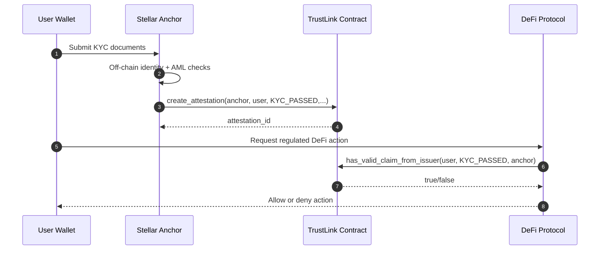

# Stellar Anchor Integration Example

This example shows a complete anchor-driven KYC flow using TrustLink:

1. Anchor is registered as a trusted issuer.
2. Anchor performs off-chain KYC checks.
3. Anchor creates an on-chain `KYC_PASSED` attestation for the user.
4. A DeFi protocol verifies that attestation before allowing access.

## Flow Overview



## Prerequisites

- Node.js 20+
- Anchor and DeFi test accounts funded on Stellar testnet
- TrustLink deployed and initialized
- Anchor already registered by admin with `register_issuer`

## Setup

```bash
cd examples/anchor-integration
npm install
cp .env.example .env
```

Set real values in your shell (or use your preferred env loader):

```bash
export RPC_URL="https://soroban-testnet.stellar.org"
export NETWORK_PASSPHRASE="Test SDF Network ; September 2015"
export TRUSTLINK_CONTRACT_ID="CDLZFC3SYJYDZT7K67VZ75HPJVIEUVNIXF47ZG2FB2RMQQVU2HHGCN8"
export ANCHOR_SECRET="S..."
export USER_ADDRESS="G..."
export DEFI_CALLER_SECRET="S..."
```

## Run

```bash
npm start
```

The script performs:

- `is_issuer(anchor)` to confirm anchor authorization
- `create_attestation(anchor, user, "KYC_PASSED", expiration, metadata)`
- `has_valid_claim_from_issuer(user, "KYC_PASSED", anchor)` as a DeFi gate

## Expected Output

- Whether anchor is registered as issuer
- Attempt to create a KYC attestation
- DeFi verification result (`true`/`false`)
- Suggested protocol action (allow/deny)

## Mapping to Production

- Move KYC verification logic to your anchor backend service.
- Keep only hash/reference metadata on-chain; store PII off-chain.
- Use issuer-specific checks in regulated protocols:
  - `has_valid_claim_from_issuer` for strict trust policies
  - `has_valid_claim` for broader trust sets
- Add revocation monitoring and expiration renewal workflows.
